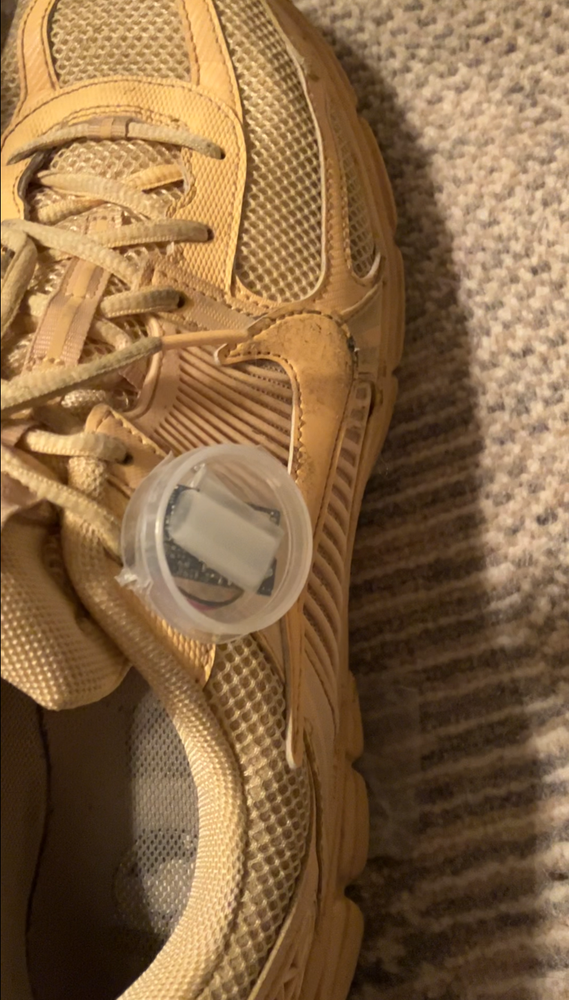
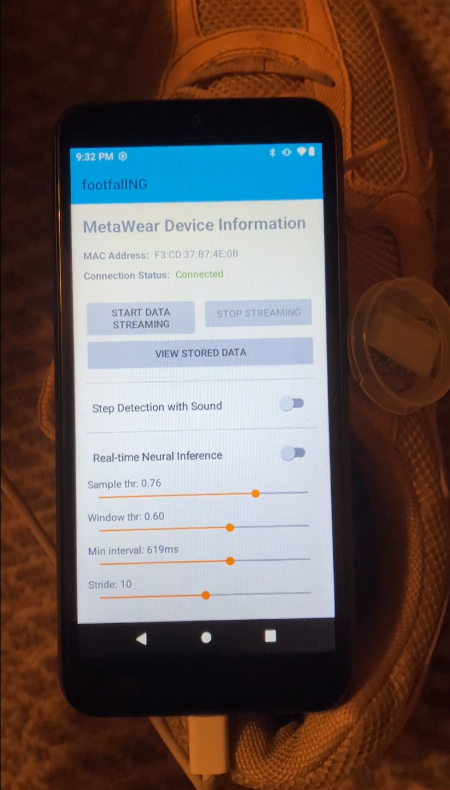

# Will James

Musical experience designer in New York

# Music Enhancement Hardware Project

## Part 1: Iola Walker

[code](https://github.com/willjamescode/iolawalker)

In music, polyrhythms are propulsion-generating overlays according to principles of musical tension and release. For example, when a song is in 4/4 time, a piano player might play a polyrhythm in dotted quarter notes to generate excitement.
Often, a person will listen to music while walking purposefully to their next destination, or take a walk while listening to music in order to relax. In the Iola Walker system, musicians record songs with an walking listener in mind, imagining typical walking paces while playing improvised parts. Multiple versions of the same song are recorded with a variety of underlying polyrhythmic pulses.

A person goes for a walk, and Iola Walker detects their walking pace. It then chooses, for the next section of a song, the version of the song with underlying polyrhythms closest to the listener’s walking pace. Iola Walker picks up footfalls using a foot-mounted IMU, processing the signals using a recurrent neural network in an android app, and outputting those signals via midi events, to be consumed by a VST plugin.

---
